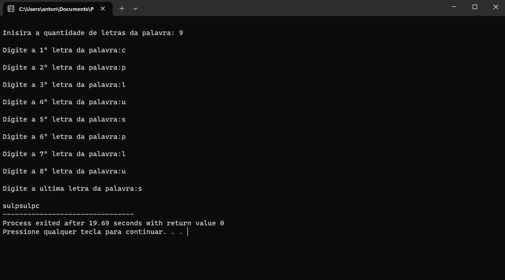

## Enunciados
### Exercicios da Aula 2 - Vetores
#### [Exercicio 001](Exercicios/exercicio1.cpp)

Fazer um programa que leia vários números inteiros e positivos. A leitura se encerra quando encontrar um número negativo ou quando o vetor ficar completo. Sabe-se que o vetor possui, no máximo, 10 elementos. Gerar e imprimir um vetor onde cada elemento é o inverso do correspondente do vetor original 

#### [Exercicio 002](Exercicios(cpp)/exercicio2.cpp)

Fazer um programa que digite vários números no vetor de tamanho máximo de 100 elementos, até digitar o número “0”. Imprimir quantos números iguais ao último número foram lidos. O limite de números é 100.  Sem considerar o “0” como último número.   

#### [Exercicio 003](Exercicios(cpp)/exercicio3.cpp)

Criar um programa que crie um vetor com 10 posições e carregue com uma palavra, depois imprima o vetor de uma maneira que exiba a palavra ao contrário (ex. casa...asac)  

#### [Exercicio 004](Exercicios(cpp)/exercicio4.cpp)

Ler um vetor V de 10 elementos e obter um vetor W cujos componentes são os fatoriais dos respectivos componentes de V. 

#### [Exercicio 005](Exercicios(cpp)/exercicio5.cpp)

Criar um programa que leia dados de um vetor de 12 elementos inteiros. Imprima o maior e menor sem ordenar, o percentual de números pares e a média dos elementos do vetor. 

#### [Exercicio 006](Exercicios(cpp)/exercicio6.cpp)

Criar um vetor com a 8 elementos e ordená-los.

#### [Exercicio 007](Exercicios(cpp)/exercicio7.cpp)

Fazer um programa que, dados dois vetores de 7 posições cada, efetue as operações aritméticas básicas, indicadas por um terceiro vetor cujos dados também são fornecidos pelo usuário, gerando e imprimindo um quarto vetor. 

